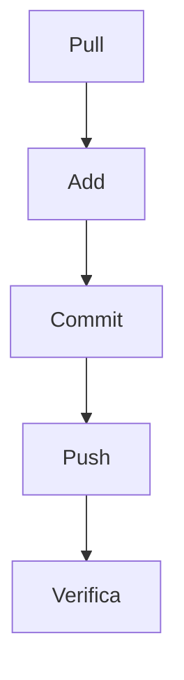

## 🔑 Reglas básicas que te salvan
- **Siempre abrir y cerrar con ```**.  
- **Después de abrir, ponés el lenguaje**: `python` para código, `mermaid` para diagramas.  
- **Nunca mezclar**: si querés mostrar código y diagrama, hacé dos bloques separados.  
- **Tablas**: usá `|` y `-` como en el ejemplo, no pegues texto plano.  



