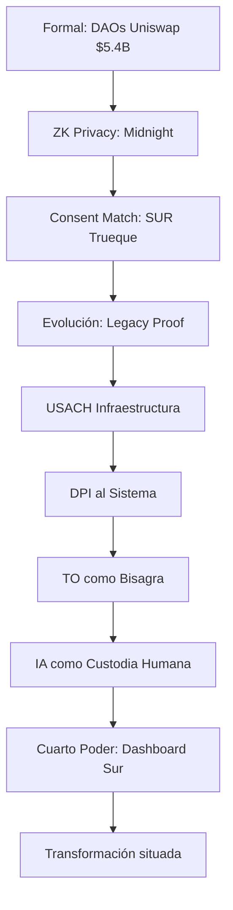
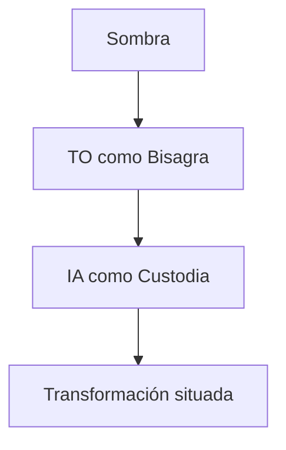
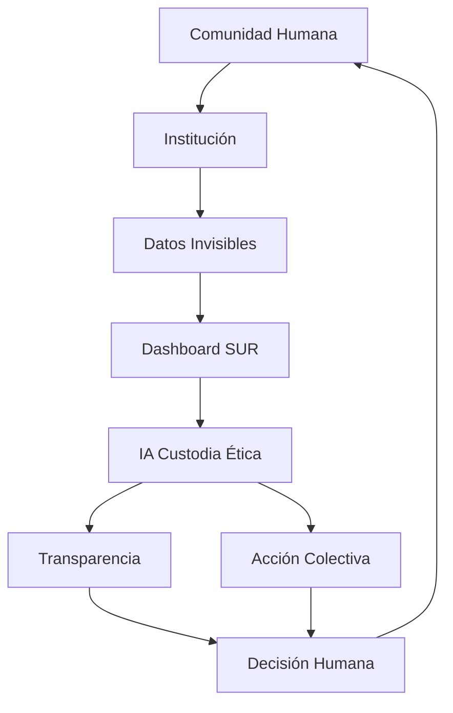
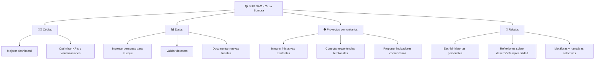
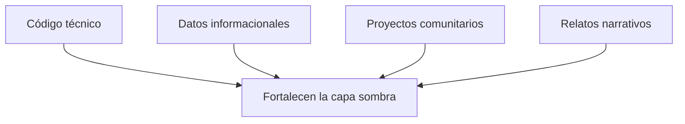
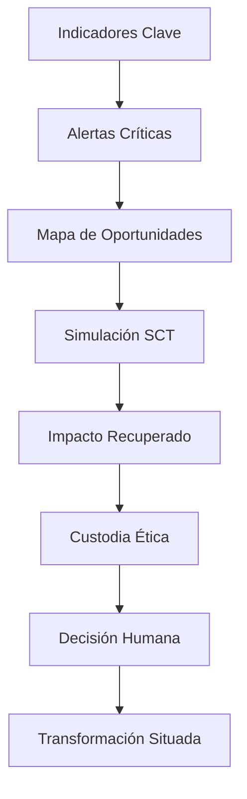

🌑
“La sombra no se vende.
La custodia no se compra.
La IA vigila, pero lo humano decide.”

SUR DAO – Dashboard para la capa sombra  
Un protocolo abierto para transformar datos invisibles en acción colectiva

**Testnet LIVE**: earthcommonsdao.netlify.app  
**Dashboard SUR**: https://surdao-dashboard.streamlit.app/ [file:82]  
**ZK Privacy**: Midnight NIGHT Glacier Drop ~30M wallets [web:113]  

## 📋 ÍNDICE
1. [Diagnóstico Sistémico](#1-diagnóstico-sistémico)
2. [Arquitectura 4 Capas](#2-arquitectura-4-capas)  
3. [SUR DAO](#3-sur-dao)
4. [Contribución](#4-contribucion)

## 1. Diagnóstico Sistémico
**LATAM Informal**: 33% PIB formal, 42% hogares dependientes [web:110]  
**Cuidado invisible**: $10.8T global [web:100]  
**DAOs**: 13k+ | $24.5B treasuries 2025 [web:100]

## 2. Arquitectura 4 Capas







# 🌑 SUR DAO - Earth Commons Dashboard

## 📖 Propósito
SUR DAO nace para visibilizar la **capa sombra** de la economía del conocimiento: ese espacio invisible donde estudiantes, carreras y comunidades sostienen el tejido social y económico.  
Este dashboard es una herramienta institucional y narrativa que conecta datos de deserción, empleabilidad y capital recuperable con la misión de SUR DAO: **transformar información en acción colectiva**.

## 🚀 Demo en vivo
👉 [Accede al Dashboard aquí](https://surdao-dashboard.streamlit.app)  
Explora indicadores, tablas y visualizaciones interactivas.

## 📊 Funcionalidades
- **KPIs principales**: total de carreras, créditos acumulados, capital recuperable.
- **Tabla interactiva**: matches SURDAO-SIES con filtros y exploración.
- **Visualizaciones narrativas**:
  - 📊 Barras: impacto económico por carrera.
  - 📈 Scatter: deserción vs capital recuperable.
  - 🔵 Bubble Chart: deserción vs empleabilidad vs capital recuperable.

## 🎨 Identidad visual
El dashboard utiliza un tema oscuro con acentos institucionales, evocando la **capa sombra** y la narrativa ética de SUR DAO.  
Colores, tipografía y símbolos están pensados para transmitir **claridad, resiliencia y comunidad**.

## 🛠️ Tecnologías
- [Streamlit](https://streamlit.io/) → interfaz interactiva.
- [Plotly](https://plotly.com/python/) → visualizaciones dinámicas.
- [Pandas](https://pandas.pydata.org/) → manejo de datos.

## 📂 Estructura del repo
- `src/dashboard_real_sies.py` → archivo principal del dashboard.
- `data/surdao_real_matches_2025.csv` → dataset base.
- `.streamlit/config.toml` → configuración de tema visual.
- `requirements.txt` → dependencias del proyecto.

## 🌍 Versión bilingüe
### English
SUR DAO reveals the **shadow layer** of the knowledge economy, where invisible efforts sustain collective progress.  
This dashboard is both an institutional tool and a storytelling artifact, turning data into **collective empowerment**.

👉 [Live Dashboard](https://surdao-dashboard.streamlit.app)

---

## 🤝 Contribución
## 🌍 Activación comunitaria
SUR DAO no es solo un dashboard: es una invitación a participar en la **capa sombra**.
### 🔗 Herramientas vivas
- [Dashboard en Streamlit](https://surdao-dashboard.streamlit.app)  
- README narrativo bilingüe  
- Chuleta de rescate en Git (para contribuir sin miedo)  
- Diagramas de flujo en Mermaid (para entender el proceso)

### 🤝 Formas de contribuir
- 👩‍💻 Desde el código: mejorar visualizaciones, KPIs y flujo técnico.
- 📊 Desde los datos: enriquecer la base de trueque y validar información.
- 🌍 Desde proyectos: integrar iniciativas comunitarias bajo la lógica de la capa sombra.

## 🔎 Caminos de aporte en SUR DAO
### 👩‍💻 1. Contribuir desde el código
Si te interesa la parte técnica:
- Clona el repo:
    
  ```bash
  
  git clone https://github.com/TIANHH77/-Earth-Commons-DAO.git
  cd -Earth-Commons-DAO
  
Instala dependencias:
pip install -r requirements.txt
Corre el dashboard en local:
streamlit run src/dashboard_real_sies.py
Propón mejoras en visualizaciones, KPIs o flujo de datos.
Abre un pull request con tus cambios.

📊 2. Contribuir desde los datos
Si tu aporte es informacional:
Revisa la carpeta data/ y el archivo surdao_real_matches_2025.csv.
Puedes añadir nuevas columnas (ej. empleabilidad, trueque, proyectos).
Documenta la fuente de tus datos en un archivo README_data.md.
Sube tu CSV actualizado y abre un pull request.

🌍 3. Contribuir desde proyectos comunitarios
Si ya ejecutas iniciativas y quieres integrarlas:
Describe tu proyecto en un archivo Markdown dentro de docs/proyectos/.
Explica cómo se conecta con la lógica de la capa sombra.
Propón indicadores o narrativas que puedan integrarse al dashboard.
Abre un issue para discutir la integración con la comunidad.

📝 4. Contribuir desde el relato

No todo aporte necesita ser técnico o numérico.  
También puedes contribuir desde tu **historia, tu experiencia y tu narrativa**:

- Escribe tu relato en un archivo Markdown dentro de `docs/relatos/`.
- Cuenta cómo tu experiencia se conecta con la **capa sombra**: deserción, trueque, comunidad, invisibilidad.
- Usa tu voz para mostrar lo que no aparece en los datos.
- Propón metáforas, imágenes o reflexiones que ayuden a otros a comprender la lógica de SUR DAO.
- Abre un **pull request** con tu relato, o un **issue** para iniciar conversación.

#### Ejemplo de estructura de relato
```markdown
# Mi historia en la capa sombra
## Contexto
(Describe tu experiencia: ingreso a la universidad, deserción, trueque, comunidad…)
## Conexión con SUR DAO
(Explica cómo tu historia refleja la capa sombra y cómo podría integrarse al dashboard o a la narrativa.)
## Reflexión
(Comparte lo que aprendiste, lo que duele, lo que inspira.)


🌳 Caminos de aporte
Cada rama del árbol representa una forma distinta de fortalecer la capa sombra:
👩‍💻 Código: quienes disfrutan del desarrollo técnico y quieren mejorar el dashboard.
📊 Datos: quienes aportan información, validan datasets o documentan nuevas fuentes.
🌍 Proyectos comunitarios: quienes ya ejecutan iniciativas y buscan integrarlas bajo esta lógica.
📝 Relatos: quienes traen su historia, metáforas y reflexiones para darle voz a lo invisible.
Cada rama es un camino, pero todas alimentan el mismo bosque: el común.
```









## 📈 KPIs Live SUR DAO
[](https://surdao-dashboard.streamlit.app/)
[](https://surdao-dashboard.streamlit.app/)
[](https://surdao-dashboard.streamlit.app/)


🧭 Filosofía
Cada camino es válido. No importa si tu aporte es técnico, informacional, comunitario o narrativo:
todos fortalecen la capa sombra y amplían el común.


  
