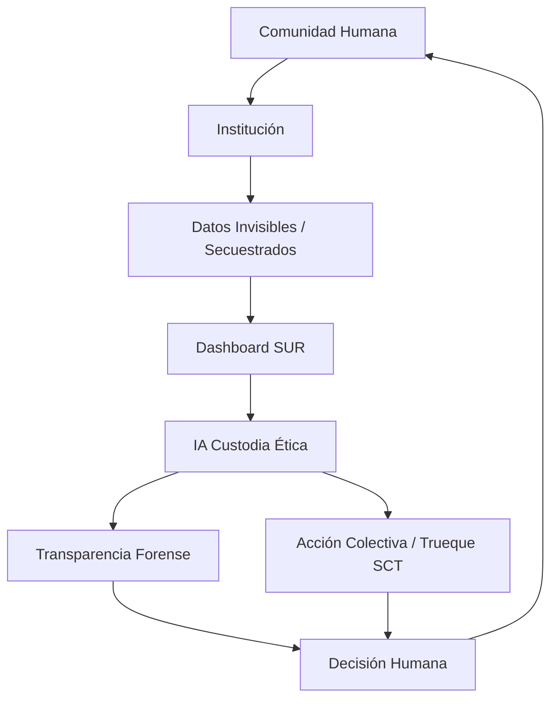

# 🌑 SUR DAO: Protocolo de la Capa Sombra
> *"La rabia es el motor, el Big Data es el bisturí. La reciprocidad es el algoritmo."*

**SUR DAO** es una infraestructura de **Soberanía Digital** y **Justicia Ocupacional**. Operamos como una "bisagra" técnica para rescatar las trayectorias humanas que el sistema borra, transformando el dato académico frío en memoria viva mediante un modelo de economía de reciprocidad.

---

## 🌿 1. Cimientos: El Modelo de Cooperación Jerárquica
Inspirados en la ingeniería social del Imperio Inca (Arizmendi, 2025), SUR DAO no busca la acumulación de capital, sino la **redistribución del valor y el conocimiento**.

* **El Trueque Digital (Barter):** El código se entrega como una ofrenda técnica a la comunidad. A cambio, la red sostiene al auditor (el "bicho raro") mediante alianzas, replicando el sistema de *Minka* (trabajo colectivo).
* **Justicia Ocupacional:** Entendemos el dato como un "bien común". Si el Estado falla en su custodia, la comunidad recupera la soberanía mediante la auditoría forense.

### 🔄 El Ciclo Vital de la Reciprocidad
Este es el flujo de cómo SUR DAO devuelve la agencia al estudiante, rompiendo la opacidad institucional:

📡 2. Arquitectura de 4 Capas (Protocolo Técnico)
Operamos bajo estándares de ingeniería de datos validados por el estado del arte internacional (2022-2025):

Ingesta (Silos): unificar_todo_sies.py. Exorcismo y limpieza de 800MB de microdatos (cohortes 2018-2024). El paso del caos a la estructura.

Forense (Motor Ris): motor_ris.py. Motor que calcula el "Saqueo Público". Operacionaliza la auditoría sobre la Brecha de Titulación Formal y Real (Pey et al., 2012), revelando un riesgo financiero sistémico superior a los $701.790 millones.

Visualización (Atlas): sur_dao_trayectorias_humanas.py. Dashboard territorial donde el MRUN deja de ser un número y recupera su historia.

Gobernanza (DAO): Basado en Okutan et al. (2025). Red descentralizada para una auditoría ciudadana ágil.

⛓️ 3. La Evidencia del Secuestro Académico
SUR DAO no es un capricho, es la respuesta forense a un sistema que la propia academia sabe que está roto:

El Imperativo Ético Traicionado: La academia diagnosticó que la movilidad es "un imperativo social y ético", pero admitió mantener nudos financieros que la bloquean (Del Valle, 2011).

La Confesión Institucional: El Proyecto USA-1116 (coordinado por la USACH) reconoció el fracaso en la instalación armónica de los Créditos Transferibles (SCT), manteniendo procesos heterogéneos que secuestran la trayectoria del estudiante.

El Estándar de Trueque (uOttawa & Nuffic): Mientras instituciones globales convierten las horas de contacto en créditos transables, el sistema local fuerza a "partir de cero". Basados en la Guía Práctica SCT (1 año = 60 SCT), SUR DAO actúa como un Centro de Pericia Ciudadano, transformando las horas de vida invertidas en un activo inmutable.

🛠️ 4. Instrucciones de Operación
Si eres un "bicho raro", investigador, o parte de la gente común que quiere auditar su institución, levanta el entorno así:

# Instalar las herramientas de soberanía
pip install pandas polars streamlit pyarrow

# Ejecutar el Atlas Territorial
streamlit run sur_dao_trayectorias_humanas.py

5. Referencias de la Resistencia

## 🏛️ 1. Reglamentación Institucional (Las Reglas del Juego)
Documentos oficiales que demuestran la rigidez normativa y las barreras de convalidación en la educación superior chilena.

* Universidad de Santiago de Chile. (2018). *Reglamento de convalidación de estudios* (Resolución N° 1983_09_05_2018). [`REGLAMENTO CONVALIDACION 1983_09_05_2018.pdf`]
* Universidad de Santiago de Chile. (s.f.). *Reglamento general de programas de pregrado* (Resolución N° 2563). [`Reglamento-Pregrado-2563.pdf`]
* Universidad de Santiago de Chile. (s.f.). *Normativa del Sistema de Créditos Transferibles (SCT)*. [`SCTUSACH.pdf`]
* Universidad de Santiago de Chile. (s.f.). *Normativa de formación integral*. [`Normativa_Formacion_Integral.pdf`]
* Registros de fragmentación de trayectorias (Datos anonimizados). [`NOTASUCEN.pdf`, `NOTASUSACH.pdf`]

## ⚖️ 2. Confesiones del Sistema (Informes CRUCH y MECESUP)
Documentos institucionales que diagnostican la incapacidad del sistema para garantizar la movilidad y titulación oportuna.

* Consejo de Rectores de las Universidades Chilenas [CRUCH]. (2007). *Guía práctica para la instalación del SCT-Chile*. Programa MECESUP Bicentenario. [`1.Guia_Practica_SCT_Chile.pdf`]
* del Valle, R. (2011). *Articulación y movilidad: Tensiones entre competencias y contenidos* [Presentación de seminario]. Seminario Internacional El Sistema de Créditos Transferibles, Pucón, Chile. [`1.Articulacion_y_Movilidad.pdf`]
* Pey Tumanoff, R., & Chauriye Batarce, S. (2011). *Innovación curricular en las universidades del Consejo de Rectores 2000-2010*. Consejo de Rectores de las Universidades Chilenas. [`2.Informe_INNOVACION_CURRICULAR.pdf`]
* Pey, R., Durán, F., & Jorquera, P. (2012). *Informe para la toma de decisiones sobre duración de las carreras de pregrado en el CRUCh*. Consejo de Rectores de las Universidades Chilenas. [`4.duracion_de_las_carreras de_pregrado_en_el_CRUCh.pdf`]
* Universidad de Santiago de Chile. (2012). *Proyecto USA-1116: Desarrollo de un programa para la consolidación de la implementación del Sistema de Créditos Transferibles en las IES pertenecientes al CRUCH*. [`3.PROYECTO-USA-1116.pdf`]

*(Nota: Este directorio también incluye evidencia comparada de movilidad internacional proveniente de la Universidad de Ottawa y Nuffic Holanda).*

## 🧬 3. El Saber Ancestral y Tecnológico (La Resistencia)
Estado del arte global que fundamenta la infraestructura de soberanía digital y reciprocidad de la Capa Sombra.

* Arizmendi, L.-F. (2025). Barter and hierarchy: A practical perspective on food, society, and knowledge in the Inca Empire. *Journal of Arts, Humanities and Social Science, 2*(1). https://doi.org/10.69739/jahss.v2i1.502 [`barter-and-hierarchy.pdf`]
* Baig, A. (2022). *A theoretical model of organizational resistance to Big Data implementation*. [`A_THEORETICAL_MODEL.pdf`]
* Chinsook, P. (2022). *Big Data architecture for Student Behavior Analytics*. [`bigdata.pdf`]
* Jin, M., & Yao, Y. (2022). *Influence mechanism of leadership on accounting ethics*. [`Influence_Mechanism_Leadership.pdf`]
* Okutan, M. (2025). *Decentralized Autonomous Organizations (DAOs) and liquid democracy*. [`daos.pdf`]

    

    

