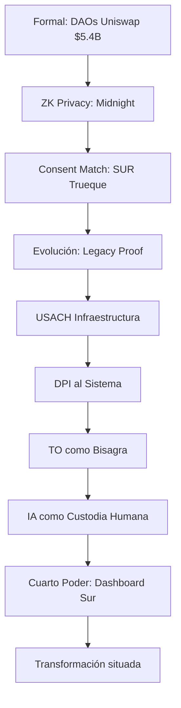
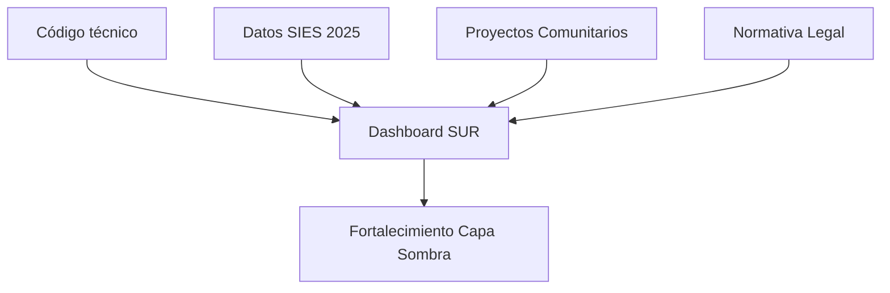
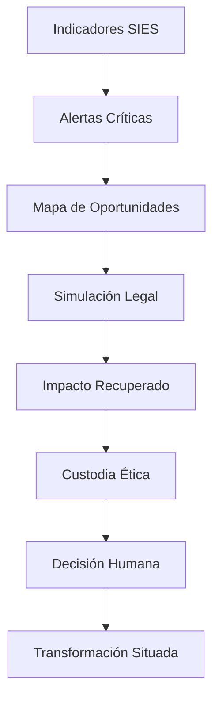
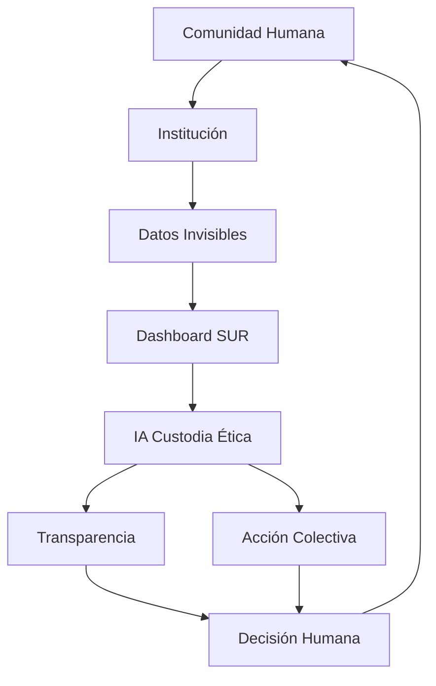

# 🌑 SUR DAO: Protocolo de la Capa Sombra
> *"La sombra no se vende. La custodia no se compra. La IA vigila, pero lo humano decide."*

**SUR DAO** es una infraestructura de resistencia diseñada para reparar la paradoja de Babel: la humanidad quiere poblar el universo, pero nuestros sistemas locales colapsan. Mientras la burocracia fragmenta la vida, nosotros construimos una **Espiral Viva** que tokeniza la actividad humana para vivir de otra manera.

---

## 📡 1. Contexto: Arquitectura de 4 Capas
No somos solo un dashboard, somos un puente entre la economía descentralizada global y la realidad local.

📡 2. La Tesis: De la Deserción al Capital Comunitario
El sistema actual diagnostica la "deserción universitaria" como un fracaso. Nosotros la auditamos como una fuga de capital social.

Utilizamos la infraestructura institucional (USACH) como bisagra para validar saberes adquiridos en la informalidad ("Capa Sombra") mediante normativas existentes que el sistema ignora.

🛠️ 3. El Motor: Dashboard de Auditoría Sistémica
Nuestra herramienta (surdao_app.py) cruza 4 dimensiones de datos para transformar la realidad:

💸 Financiera: Cruce de Oferta Académica vs Retención para calcular los MM$ perdidos.

⚖️ Legal (Hacking Normativo): Aplicación de Res. 8417 (Formación Integral) y Res. 1983 (Convalidación).

🗺️ Territorial: Matriz de Movilidad Regional que visualiza la fuga de talentos.

⏳ Temporal: Cálculo de la Sobreduración como "tiempo de vida robado".

Mecánica de Recuperación

🔄 4. El Ciclo Vital: Retorno a la Comunidad
El objetivo final no es el dato, es la Acción Colectiva.

📂 Estructura del Repositorio

SUR-DAO/
├── surdao_app.py      # El Código Maestro (Dashboard v5)
├── requirements.txt   # Dependencias (Streamlit, Pandas, Plotly)
├── data/              # La Bencina del Sistema (CSVs SIES 2025)
│   ├── Oferta_Academica...
│   ├── Informe_Retencion...
│   ├── Movilidad-Regional...
│   └── Duracion_Real...
└── docs/              # La Base Legal (PDFs Resoluciones)

