# 🌑 SUR DAO: Protocolo de la Capa Sombra
> *"La sombra no se vende. La custodia no se compra. La IA vigila, pero lo humano decide."*

**SUR DAO** es una infraestructura de resistencia diseñada para reparar la paradoja de Babel: la humanidad quiere poblar el universo, pero nuestros sistemas locales colapsan. Mientras la burocracia fragmenta la vida, nosotros construimos una **Espiral Viva** que tokeniza la actividad humana para vivir de otra manera.

---

## 📡 La Tesis: De la Deserción al Capital Comunitario
El sistema actual diagnostica la "deserción universitaria" como un fracaso. Nosotros la auditamos como una **fuga de capital social**.

Utilizamos la infraestructura institucional (USACH) como **bisagra** para validar saberes adquiridos en la informalidad ("Capa Sombra") mediante normativas existentes que el sistema ignora.

### 🧬 Arquitectura del Sistema

```mermaid
graph TD
    A[Código técnico] --> E[Dashboard SUR]
    B[Datos SIES 2025] --> E
    C[Proyectos Comunitarios] --> E
    D[Normativa Legal] --> E
    E --> F[Fortalecimiento Capa Sombra]
```

  
🛠️ El Motor: Dashboard de Auditoría Sistémica
Nuestra herramienta (surdao_app.py) cruza 4 dimensiones de datos para transformar la realidad:

💸 Financiera: Cruce de Oferta Académica vs Retención para calcular los MM$ perdidos.
⚖️ Legal (Hacking Normativo): Aplicación de Res. 8417 (Formación Integral) y Res. 1983 (Convalidación) para convertir actividades como "ollas comunes" en créditos académicos.
🗺️ Territorial: Matriz de Movilidad Regional que visualiza la fuga de talentos hacia la capital.
⏳ Temporal: Cálculo de la Sobreduración como "tiempo de vida robado".

Flujo de Transformación

```mermaid
graph TD
    A[Indicadores SIES] --> B[Alertas Críticas]
    B --> C[Mapa de Oportunidades]
    C --> D[Simulación Legal]
    D --> E[Impacto Recuperado]
    E --> F[Custodia Ética]
    F --> G[Decisión Humana]
    G --> H[Transformación Situada]
```

📂 Estructura del Repositorio
SUR-DAO/
├── surdao_app.py      # El Código Maestro (Dashboard v5)
├── requirements.txt   # Dependencias (Streamlit, Pandas, Plotly)
├── data/              # La Bencina del Sistema (CSVs SIES 2025)
│   ├── Oferta_Academica...
│   ├── Informe_Retencion...
│   ├── Movilidad-Regional...
│   └── Duracion_Real...
└── docs/              # La Base Legal (PDFs Resoluciones)

🧬 Nodos Activos en la Espiral
📍 Nodo 01: La Bisagra Institucional (USACH)
Utilizamos el Reglamento de Convalidación (Res. 1983) para hackear la malla curricular rígida.
Objetivo: Transformar al "desertor" en "agente comunitario validado".

📍 Nodo 02: Custodia de Trayectorias (Caso Haroldo Horta)
El piloto de prueba. Demostración empírica de cómo una vida "descartada" por la burocracia (sin pensión, nómade) posee un valor patrimonial incalculable.
Ver Nodo: Atlas Haroldo Horta

📍 Nodo 03: Economía Recíproca
Un mercado donde no se acumula, se circula. Trueque consentido y depuración de residuos sistémicos.

